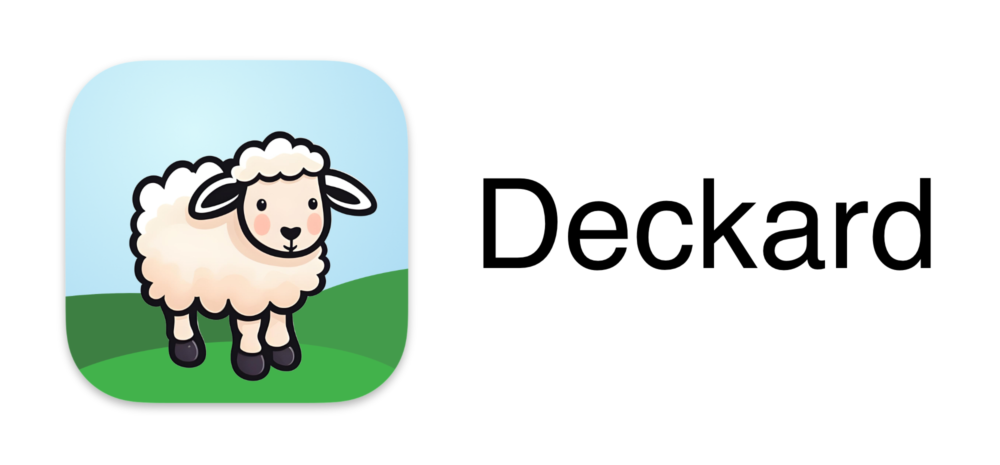
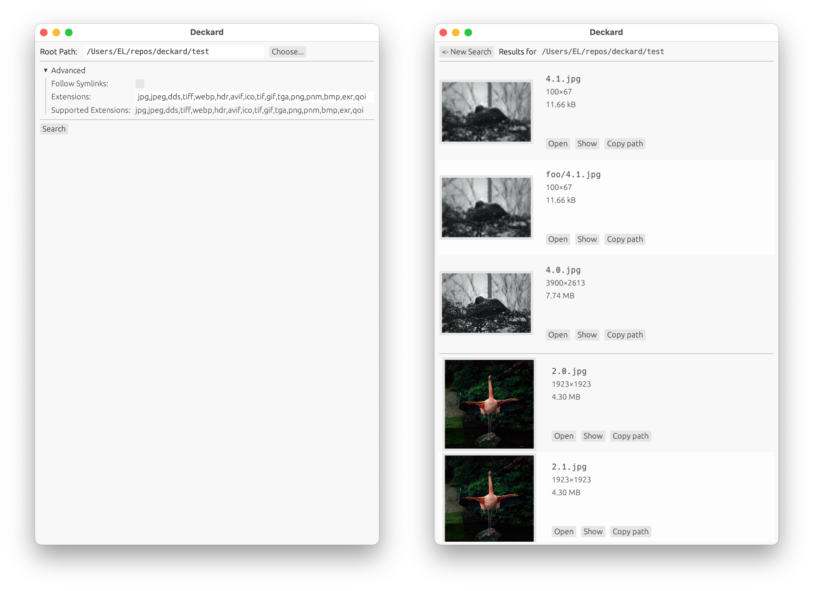

Deckard is a Rust program for finding duplicate images. It recursively walks a file system, computing a perceptual hash of each image it finds, and displaying sets of images with the same hash. Using a perceptual hash allows it to find matching images even after being resized or lightly modified.

# Building

You can use `cargo build [--release]` to build a bare binary.

On Mac OS, `build_macos.sh` runs `cargo build`, then `/scripts/make-app.sh`, which builds `Deckard.app` (in `target/{BUILD_MODE}/Deckard.app`).

Deckard also supports being bundled in to an app on multiple platforms with [cargo-bundle](https://github.com/burtonageo/cargo-bundle); the app will be built in `target/{BUILD_MODE}/bundle/{PLATFORM}/`. 

